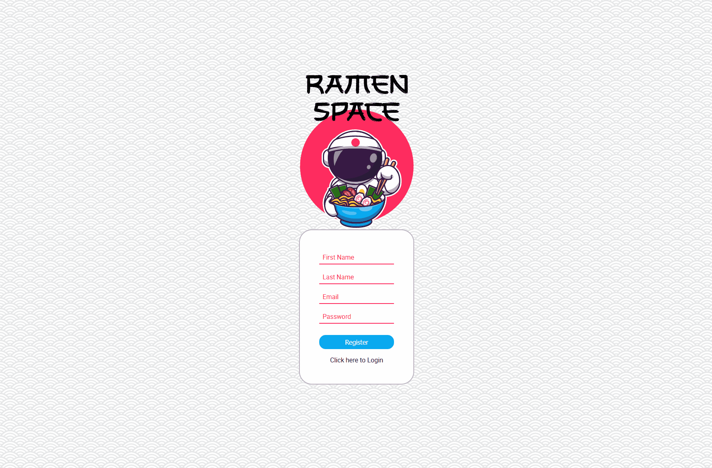

# ramen space - a place for all ramen lovers to connect

_project done during the SPICED academy Full Stack Web Development bootcamp_

## Tools & Technologies

-   ReactJS
-   Node.js/ Express.js
-   PostgreSQL
-   AWS
-   Socket.io

## Project Overview

-   Registration and Login page (with error display)
-   Bcrypt for password protection
-   Bio always updatable in the user profile
-   Profile message Feed for User who are connected
-   Friend search tool
-   People can be befriended, unfriended and request can be declined
-   Chat
-   Settings in modal to update profile image or delete account

-   Project is optimised for mobile devices

### Intro

<kbd></kbd>

### More

-   Backgroundpattern and Burgermenu Icon made by me
-   Logo: <a href="https://www.freepik.com/free-vector/cute-astronaut-eating-ramen-cartoon-science-food-icon-concept-isolated-flat-cartoon-style_11579999.htm">Image by catalyststuff</a> on Freepik
-   Font: Shikamaru by Arterfak Project
